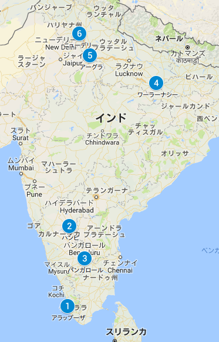
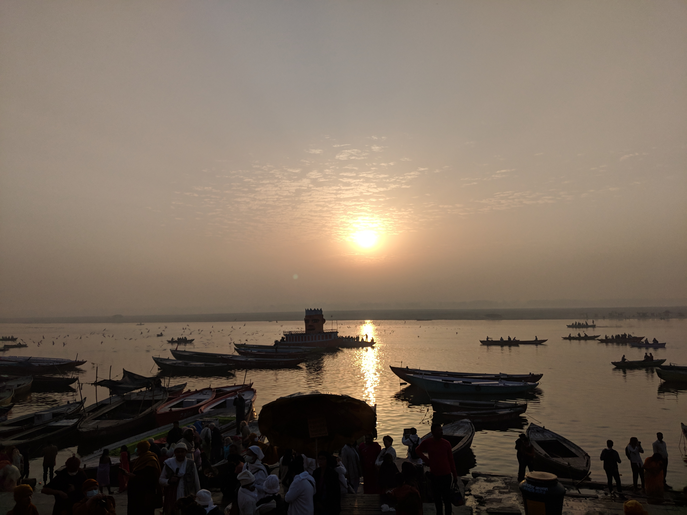
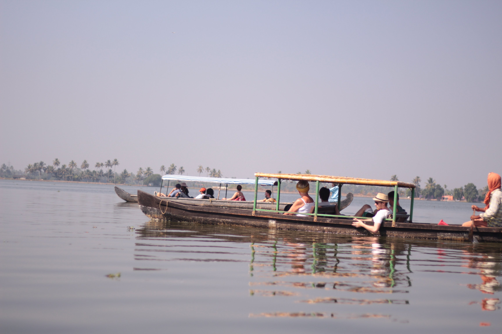

## 旅するエンジニア（インド編）

三浦 信二(@40balmung)

+++

## 自己紹介

#### 三浦 信二
##### Software Engineer
(Ruby/Java/Groovy/Android/Kotlin/Vim)

+++

### ギークハウス歴

- ギークハウス新丸子（2016/05〜2016/09） |
- ギークハウス元住吉（2016/10〜2017/09） |
- ギークハウス新宿四谷（2018/01〜） |

---

## 今日お話したいこと

- 旅するエンジニアって？
- インドへ旅行しながらお仕事したお話
- 旅しながら仕事はできるのか

---

## 旅するエンジニアって？

+++?image=assets/なんか旅しているイメージ３枚ぐらい

+++

### 日本のお客さんから お仕事をもらってリモートワーク

+++

### 最初は リモートワークOKな会社に

+++

### フリーランスになって リモートワークOKの案件 のみを受けてます

+++

作業場所は

- 自宅のシェアハウス |
- カフェ |
- コワーキングスペース |
- 実家 |
- etc... |

+++

## リモートワークなら どこで仕事してもいいじゃない

+++

# 旅しながらでも仕事ができる！

+++

### 仕事しながら旅したところ

- 日本 |
- 台湾 |
- 中国（上海） |
- アメリカ（西海岸＋NY） |
- インド ←NEW! |

+++

## アメリカは2ヶ月半滞在の長期プロジェクト！

+++

### このお話はまたどこかで…

---

## インドへ旅行しながらお仕事したお話

---

## そもそものきっかけ

+++

シェアハウス同居人 「インド映画にハマっているんだけど、 現地でインド映画見たいんですよね〜」

+++

煽り癖のあるボク 「よし！じゃあ行こうぜ！」

+++

# 以上。

+++

## というわけで 12日間インドへ行くことに

+++

+++

+++

+++

# はい

---

## みなさんのインドの印象

+++

### みなさんの中で
### インドに行かれた方はいますか？

+++

### インドに行かれた人で
### 「また行きたい」
### と思う方はいますか？

+++

## インドへ旅行した人は 両極端の感想

+++

### 「また行きたい」
### 「二度と行きたくない」

+++

### 更には旅行好きな人も避けるインド

+++

### インド…
### いったいどんなところなんだ…

---

## インドで行った場所

1. アレッピー
1. ハンピ
1. バンガロール
1. バラナシ
1. アーグラ
1. デリー

+++

+++

## 南から北上するルート

+++

### ほぼ移動しっぱなしの ハードスケジュール

---

## インド人について

+++

+++

### 詐欺師やぼったくりが多い国インド

+++

### ですが
### インド人は人懐っこくて話好き

+++

### 日本人が珍しいのか
### 興味津々でこちらを見てきます

+++

### 手を降ったり挨拶すると
### 笑顔で話しかけてきます

+++

### そしてセルフィ

+++

### すぐに友達になれますよ！

---

## 食事について

+++

### インドの食事は

+++

# おいしい！

+++

### ただし北は油が多く胃腸にきます

+++

### 最初は南インドの優しい料理で
### 徐々に慣らしていくのをおすすめします

+++

### カレーだけでなく
### スパイスが効いているものが多い

+++

### 辛いのが苦手でも
### 辛さ抑えめの料理も多いので安心

+++

### インドの半数はベジタリアン

+++

### 肉も牛や豚はあまり無く
### 鶏か羊がメイン

+++

### スイーツはめちゃ甘い

+++

### シロップ漬けのスイーツも多い
### 美味しいかどうかは…

+++

### ボクは甘いも辛いも得意なので
### 楽しめましたがお腹にはお気をつけて

---

## チャイ

+++

### インドといえばチャイ

+++

### インド人も大好きな国民飲料

+++

### 一杯5~10ルピーぐらいで
### 小さな紙コップ一杯ぐらい

+++

### ミルクティーに
### 生姜が効いている感じ

+++

### マサラチャイは
### チャイにスパイスが入った
### 甘くないミルクティー

+++

### こちらも美味しいのでおすすめ

+++

### ボクは一日4杯ぐらい飲んでました

---

## 英語について

+++

### インド人は
### かなりの確率で英語が話せる

+++

### そのため
### 海外で英語を使ったことがある人は
### 言葉の壁は無い

+++

# うそ

+++

### たまに
### なまりが酷い人がいる

+++

### Rを発声したり
### かなり独特なので
### リスニングは要注意

+++

### ちなみにボクは
### ちょっとした英会話しかできません 
### が、それでも問題なし

---

## インドのインフラ事情

+++

### 仕事するには

- 電源
- WIFI

## は必須!!

+++

### じゃあ電源カフェに行こう

+++

# 地方にカフェなどない

+++

### 特に南の地方に行く際には
### お気をつけて

+++

## ネットワークをつなぐには
## SIM契約必須

+++

## 電話番号が必要なアプリも
## あるので必ず契約しましょう

---

## よかった場所

+++

## 北インド

## 遺跡や世界遺産が多い

+++

## ガンジス川(バラナシ)

+++

## タージマハル(アーグラ)

+++

## 南インド

## 地方はのんびり過ごすのによい
## バンガロールはIT技術者は楽しい

+++

## 遺跡群と岩と絶景(ハンピ)
+++

+++

+++

## ボート(アレッピー)

+++

+++

## 技術者交流(バンガロール)

---

## 旅しながら仕事はできるのか

+++

# 結論

+++

# 観光目的なら無理

+++

### 今回のように観光と移動がメインだと正直仕事をする時間が取れない

+++

### そのため
### 一ヶ月同じ場所に滞在するなどして
### 観光は土日にするなどが良い

+++

## フリーランス1人では辛い

+++

### ボクは案件をチームで受けています

+++

### 正直、今回は仕事の時間があまり取れず
### チームメンバーにかなり助けてもらいました

+++

### 1人で仕事を抱えて
### このハードスケジュールは無理

+++

### 旅をしながら仕事するなら
### チームで助け合うのがおすすめ

---

これからは

- チームで |
- リモートワークで |

仕事する時代

+++

## 長期間、別の国に滞在すれば仕事もなんとかなる

+++

## みんなも旅しながらお金を稼ごう！

---

# Q&A

---

# おしまい
